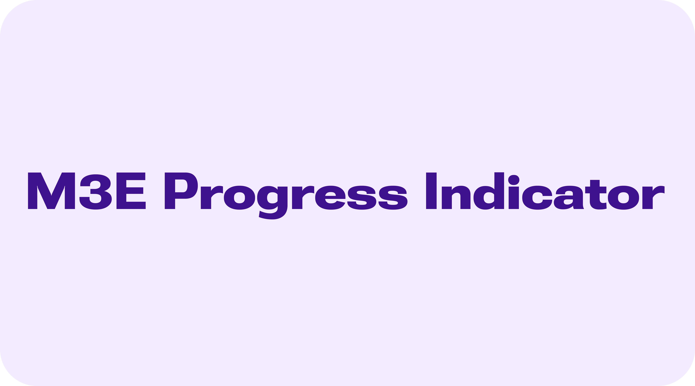
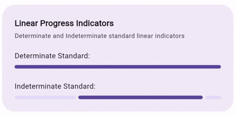
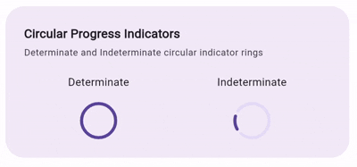
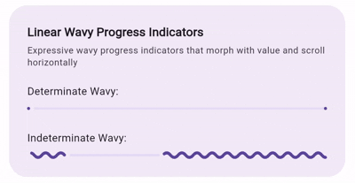
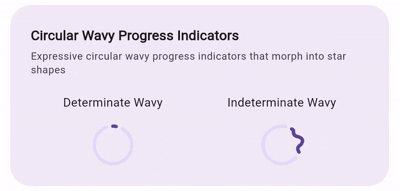

# M3E Progress Indicator



A Flutter package providing Material 3 Expressive (M3E) standard and wavy progress indicators. It enables smooth determinate progress transitions, scrolling indeterminate waveforms, customizable track end-stops, and wave amplitude morphing for both linear and circular layouts.

> [!NOTE]
> `m3e_progress_indicator` is a part of the larger **[m3e_core](https://github.com/Mudit200408/m3e_core)** ecosystem.

---

## 🎮 Interactive Demo

You can try out the package UI demo here: [m3e_core demo](https://mudit200408.github.io/m3e_core/)

---

## 🚀 Features

- **Linear & Circular Standard Indicators** — high-performance standard determinate and indeterminate indicator lines and rings.
- **Linear & Circular Wavy Indicators** — expressive, wave-shaped indicators that morph into star shapes or scroll horizontally with custom speed.
- **Track Gaps and Stops** — built-in support for Material 3 design characteristics, including end-stop points and gaps between the progress line and track.
- **Smooth Indeterminate Animations** — continuous looping waveforms and rotations for loading indicators when no value is provided.
- **RTL Support** — fully compatible with right-to-left layout directions out of the box.

---

## 📦 Installation

Add the package to your `pubspec.yaml`:

```yaml
dependencies:
  m3e_progress_indicator: ^0.0.1
```

Import it in your Dart code:

```dart
import 'package:m3e_progress_indicator/m3e_progress_indicator.dart';
```

---

## 🧩 Quick Start

### 1. Standard Linear Progress Indicator

A standard Material 3 linear indicator with a customized end-stop and gap size:



```dart
M3ELinearProgressIndicator(
  value: 0.7,
  minHeight: 6.0,
  gapSize: 4.0,
  stopSize: 4.0,
)
```

### 2. Standard Circular Progress Indicator

A standard circular loading ring. Leave the `value` as `null` for an indeterminate animation:



```dart
M3ECircularProgressIndicator(
  value: null, // Indeterminate
  strokeWidth: 4.0,
  size: 48.0,
)
```

### 3. Wavy Linear Progress Indicator

An expressive linear wave indicator with custom wavelength and scrolling speed:



```dart
M3ELinearWavyProgressIndicator(
  value: 0.5,
  strokeWidth: 6.0,
  trackStrokeWidth: 4.0,
  wavelength: 20.0,
  waveSpeed: 15.0,
)
```

### 4. Wavy Circular Progress Indicator

An expressive circular wave indicator that bends a sinusoidal path around a circle. Leave `value` as `null` for a rotating indeterminate wavy loader:



```dart
M3ECircularWavyProgressIndicator(
  value: null, // Indeterminate
  strokeWidth: 5.0,
  wavelength: 18.0,
  waveSpeed: 10.0,
)
```

---

## 📖 Detailed API Guide

### 1. `M3ELinearProgressIndicator`

| Parameter | Type | Default | Description |
|-----------|------|---------|-------------|
| `value` | `double?` | `null` | Progress value between 0.0 and 1.0. If null, the indicator is indeterminate. |
| `color` | `Color?` | Theme active | Active progress line color. |
| `backgroundColor` | `Color?` | Theme track | Background track color. |
| `minHeight` | `double` | `4.0` | Height/thickness of the indicator. |
| `strokeCap` | `StrokeCap` | `StrokeCap.round` | End styling of progress line and track. |
| `gapSize` | `double` | `4.0` | Gap between the active progress line and track. |
| `stopSize` | `double` | `4.0` | Size of the end stop indicator on the track. |
| `width` | `double` | `double.infinity` | Width of the container. |

---

### 2. `M3ECircularProgressIndicator`

| Parameter | Type | Default | Description |
|-----------|------|---------|-------------|
| `value` | `double?` | `null` | Progress value between 0.0 and 1.0. If null, the indicator is indeterminate. |
| `color` | `Color?` | Theme active | Active progress ring color. |
| `backgroundColor` | `Color?` | Theme track | Background track color. |
| `strokeWidth` | `double` | `4.0` | Thickness of the active progress path. |
| `strokeCap` | `StrokeCap` | `StrokeCap.round` | End styling of the progress path. |
| `gapSize` | `double` | `4.0` | Gap between active progress and track. |
| `size` | `double` | `48.0` | Height/width diameter of the indicator. |

---

### 3. `M3ELinearWavyProgressIndicator`

| Parameter | Type | Default | Description |
|-----------|------|---------|-------------|
| `value` | `double?` | `null` | Progress value between 0.0 and 1.0. If null, the indicator is indeterminate. |
| `color` | `Color?` | Theme active | Active waveform color. |
| `backgroundColor` | `Color?` | Theme track | Track color. |
| `strokeWidth` | `double` | `4.0` | Stroke width of the active wavy line. |
| `trackStrokeWidth` | `double` | `3.0` | Stroke width of the track. |
| `gapSize` | `double` | `4.0` | Gap between active progress and track. |
| `stopSize` | `double` | `4.0` | Size of the end stop indicator on the track. |
| `wavelength` | `double` | `24.0` | Preferred wavelength of the wave. |
| `waveSpeed` | `double` | `24.0` | Scrolling speed of the wave in pixels per second. |
| `height` | `double` | `20.0` | Height of the container layout box. |
| `width` | `double` | `240.0` | Width of the progress bar. |
| `amplitude` | `double Function(double)?` | Preset | Function returning wave amplitude based on progress. |

---

### 4. `M3ECircularWavyProgressIndicator`

| Parameter | Type | Default | Description |
|-----------|------|---------|-------------|
| `value` | `double?` | `null` | Progress value between 0.0 and 1.0. If null, the indicator is indeterminate. |
| `color` | `Color?` | Theme active | Active waveform color. |
| `backgroundColor` | `Color?` | Theme track | Track color. |
| `strokeWidth` | `double` | `4.0` | Stroke width of the active wavy line. |
| `trackStrokeWidth` | `double` | `4.0` | Stroke width of the track. |
| `gapSize` | `double` | `4.0` | Gap between active progress and track. |
| `wavelength` | `double` | `24.0` | Wavelength/frequency spacing of waves on the circle. |
| `waveSpeed` | `double` | `24.0` | Wave oscillation speed. |
| `size` | `double` | `48.0` | Diameter size of the circular layout. |
| `amplitude` | `double Function(double)?` | Preset | Function returning wave amplitude based on progress. |

---

## 🐞 Found a bug? or ✨ You have a Feature Request?

Feel free to open an [Issue](https://github.com/Mudit200408/m3e_progress_indicator/issues) or [Contribute](https://github.com/Mudit200408/m3e_progress_indicator/pulls) to the project.

Hope You Love It!

---

### Radhe Radhe 🙏
